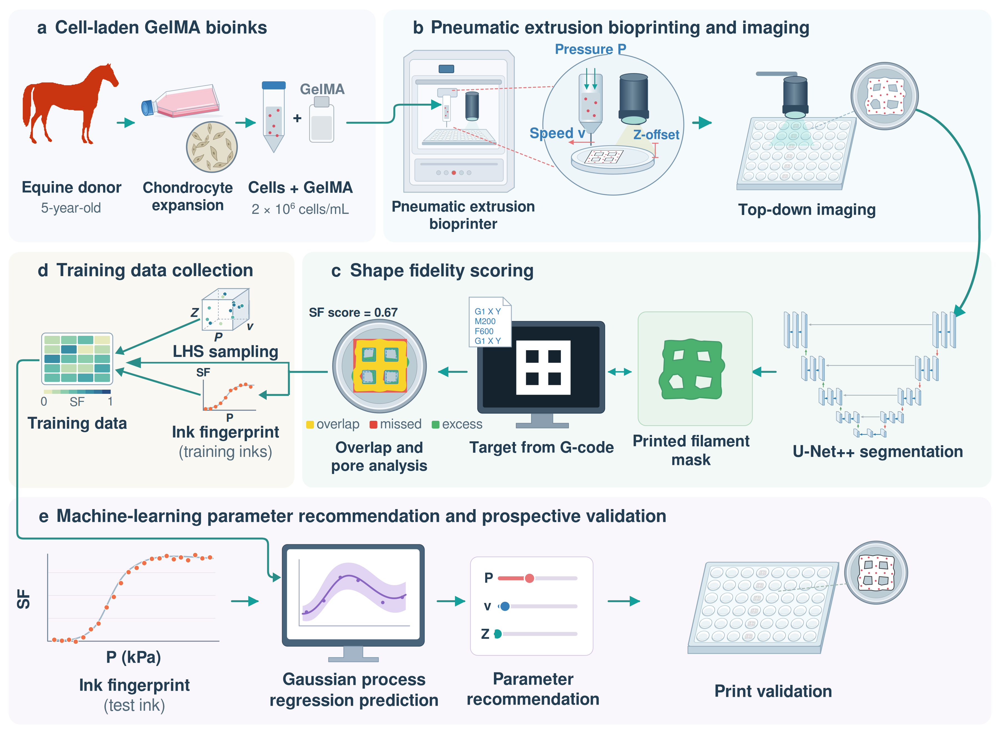

# ml_parameter_ebb_gelma
Machine-learning-guided parameter selection for extrusion bioprinting of unseen cell-laden GelMA bioinks




This repository provides the implementation of a workflow that integrates machine learning into extrusion bioprinting to select printing parameters (extrusion pressure, printing speed and Z offset) for new cell-laden bioinks.
The workflow covers imaging on the printer, automated shape fidelity scoring, Gaussian process regression recommendation and prospective printing. <br/>
<br/>


## Descriptions
- The pipeline consists of:
  - U-Net++ segmentation of top-down images of every printed well
  - shape fidelity (SF) scoring against the target lattice from the G-code
  - pressure ramp descriptors (ink fingerprint) as ink-level model inputs
  - Gaussian process regression recommending a printing condition for a bioink left out of training
- We evaluated the workflow with eight batch-matched GelMA inks (7.5% and 10% w/v, DoF 60% and 80%, with and without equine chondrocytes), 1792 prints in total

## Installation
```bash
python3 -m venv venv
source venv/bin/activate        # Windows: venv\Scripts\activate
pip install -r requirements.txt
```

## Run (Example Workflow)

### Segmentation and shape fidelity scoring
```bash
python3 unetplusplus_train.py
python3 unetplusplus_test_gelma.py
python3 draw_target_geometry_deployment.py
python3 run_pipeline.py
```

### Ink fingerprint
```bash
python3 sweep_fingerprint.py
```

### Recommendation and evaluation
Scripts for model training, recommendation, G-code generation for the prospective prints and evaluation are in
```bash
ml_parameter_ebb_gelma/gelma_ml_opt
```

## Data Availability
- The data cannot be made publicly available because they are not in a format that is sufficiently accessible or reusable by other researchers.
- The data, including the raw images and their annotations, are available upon reasonable request (H.Mo@umcutrecht.nl).


## References
```
Mo, Hyunho, Lisanne Dechant, Anna Celli, Maaike Braham, Sam F. B. van Beuningen, Riccardo Levato, and Jos Malda. "Machine-learning-guided parameter selection for extrusion bioprinting of unseen cell-laden GelMA bioinks." To be submitted to Biofabrication.
```

## Acknowledgments
```
  This work was carried out within the AI-BioRM project and is part of the UMC Utrecht AI Lab for Living Technologies (Biofabrication & Disease Modelling). This work was financially supported by the Public-Private Partnership (PPP) Allowance made available by Health~Holland, Top Sector Life Sciences & Health (Stichting LSH-TKI), to stimulate public-private partnerships, and allocated by UMC Utrecht to the project AI-BioRM (UMC Utrecht project number V0002717). This work used the Dutch national e-infrastructure with the support of the SURF Cooperative using grant no. EINF-18884.
```